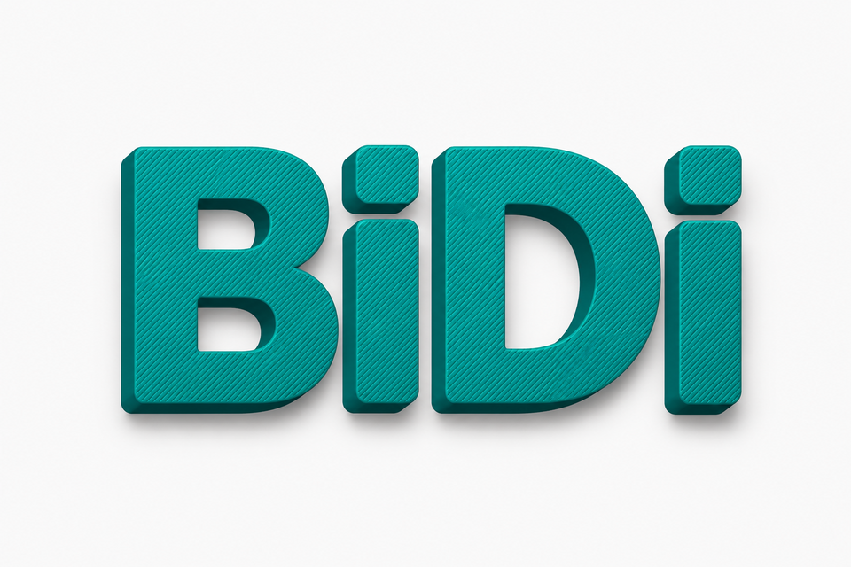

<p align="center">
  <picture>
    <source media="(prefers-color-scheme: dark)" srcset="./media/bidisense-dark.png">
    
  </picture>
</p>

<p align="center">
  <a href="https://github.com/EmadHelmi/BiDiSense/releases"></a>
  <a href="https://github.com/EmadHelmi/BiDiSense/actions/workflows/ci.yml"></a>
  <a href="https://github.com/EmadHelmi/BiDiSense/blob/master/cursor.js"></a>
  <a href="https://github.com/EmadHelmi/BiDiSense/stargazers"></a>
  <a href="https://github.com/EmadHelmi/BiDiSense/blob/master/LICENSE"></a>
  <a href="https://github.com/EmadHelmi/BiDiSense/blob/master/cursor.js"></a>
</p>

**BiDiSense** is a collection of paste-and-run snippets that make coding agents detect script direction and render **RTL** and **LTR** correctly. Cursor is the first host. The current snippet watches Agent messages, the live prompt, user history, Markdown Preview, lists, and tables independently, while keeping code blocks left-to-right.

Built for people who write mixed bidirectional text (Persian, Arabic, Hebrew, and English) inside AI coding tools whose UI assumes a single direction.

> [!NOTE]
> Unofficial. BiDiSense is not affiliated with Cursor or Anysphere. It injects CSS and observers through Chromium DevTools snippets, so a host UI update can break selectors until the snippet is adjusted.

## Features

- **Per-message direction** — each Agent reply is scored on its own script and flipped to RTL or LTR without forcing the whole thread.
- **Live prompt** — the composer follows the script you are typing, including IME composition.
- **User history** — previous human messages keep the direction they were written in.
- **Markdown Preview** — document body, lists, and tables are detected separately.
- **Code stays LTR** — fenced blocks, inline code, and Monaco/editor surfaces keep `direction: ltr`.
- **Safe re-run** — running the snippet again tears down previous observers, listeners, and injected styles before applying a new runtime.
- **Readable RTL type** — Vazirmatn is applied to Agent and preview prose (install the font on your system for best results).

## Quick Start

1. Open **Cursor**.
2. Open Developer Tools: **Help → Toggle Developer Tools**.
3. Open the **Sources** tab.
4. Open **Snippets** in the left sidebar (use the `>>` overflow menu if it is hidden).
5. Click **New snippet** and name it, for example `cursor-smart-rtl`.
6. Paste the entire [`cursor.js`](cursor.js) file.
7. Save: `Ctrl+S` (Linux/Windows) or `Cmd+S` (macOS).
8. Run it: right-click inside the snippet and choose **Run**.

The snippet stays saved in DevTools, but you must run it again after Cursor restarts or the window reloads unless you add a separate startup hook.

A purple console banner (`RTL Fix + Smart Preview + Smart Agent Applied`) confirms the runtime is active.

### Uninstall

Re-run is idempotent. To remove the effect without restarting Cursor, reload the window (**Developer: Reload Window**) or close DevTools after a full Cursor restart so the injected style and observers are gone.

## How it works

The snippet injects a stylesheet, then a `MutationObserver` plus input listeners:

1. Collect strong Arabic vs Latin characters in the relevant node.
2. Assign `data-cursor-smart-*` attributes (`rtl` / `ltr`) per surface.
3. CSS `[data-…]` rules set `direction` and alignment. Code selectors win with `!important` so editors never flip.

Selector names track Cursor's DOM (`markdown-root`, `aislash-editor-input`, `tiptap.ProseMirror`, …). When Cursor ships a UI rewrite, those names are the first thing to update.

## Compatibility

| Host | Status |
| --- | --- |
| Cursor (Chromium DevTools snippets) | Supported (`cursor.js` v7.0.0) |
| VS Code, Windsurf, other agents | Planned as additional snippets |

**Font:** [Vazirmatn](https://github.com/rastikerdar/vazirmatn) is referenced by name. Install it locally if RTL prose looks like the system fallback.

## Repository layout

```
cursor.js                 Cursor DevTools snippet
media/                    README logos (dark / light)
docs/github-rulesets.md   Recommended GitHub branch rules
.cursor/rules/            Agent workflow for this repo
.github/                  CI, PR template, issue templates, CODEOWNERS
```

## Contributing

Contributions are welcome. Please read the [Contributing Guide](CONTRIBUTING.md) before opening an issue or pull request.

Short version:

- Do not push to `master`. Open a PR.
- Branch names: `feat/001-short-description` (also `fix`, `bugfix`, `imp`, `docs`, `chore`, …).
- Sign commits with GPG as `Emad Helmi <s.emad.helmi@gmail.com>`.
- Keep `cursor.js` a single pasteable file.

## Security

See [SECURITY.md](SECURITY.md) for how to report a vulnerability privately.

## License

[MIT](LICENSE) © 2026 [Emad Helmi](https://github.com/EmadHelmi)

## Support

**If this project is helpful, you may wish to give it a** :star2:

- GitHub: [EmadHelmi](https://github.com/EmadHelmi)
- Telegram: [EmadHelmi](https://t.me/EmadHelmi)

## Stargazers over Time

[](https://starchart.cc/EmadHelmi/BiDiSense)
